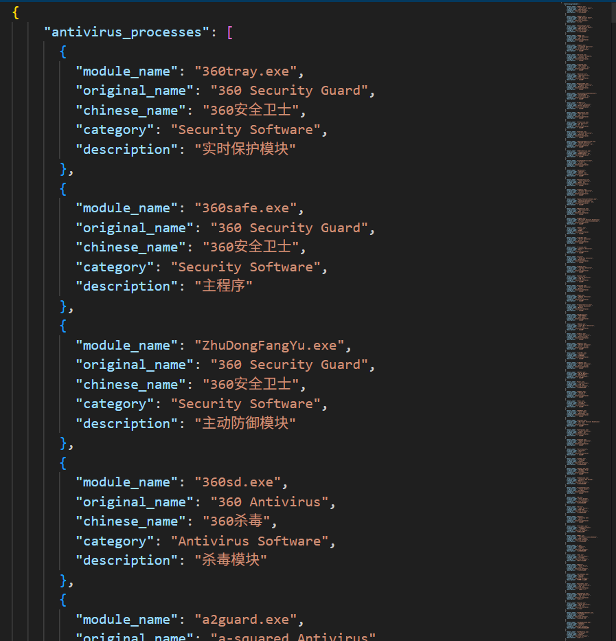
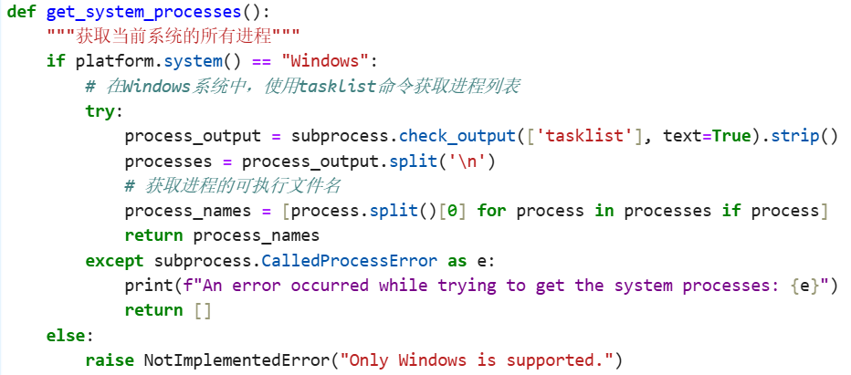
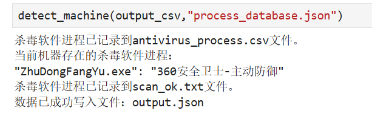
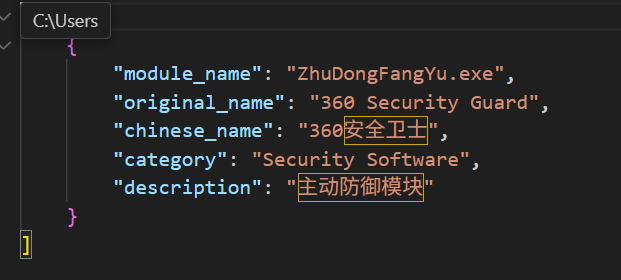

# 5.8

杀毒软件检测

- 输入进程名列表、文件名列表、进程模块列表
- 输出识别到的安全软件信息。

要求

1、建立JSON格式的数据库

对手机来的数据进行清洗去重等

包含列模块名，安全软件原名，安全软件中文名，类别，描述

2、输入支持多种格式，csv，json等

3、输出用json格式。

1、构建杀毒软件信息数据库 json格式

2、检测系统内所有的进程是否是杀毒软件进程并输出成CSV格式

获取进程核心代码

3、输出检测到的杀毒软件进程及其相关信息并存储为JSON文件。

