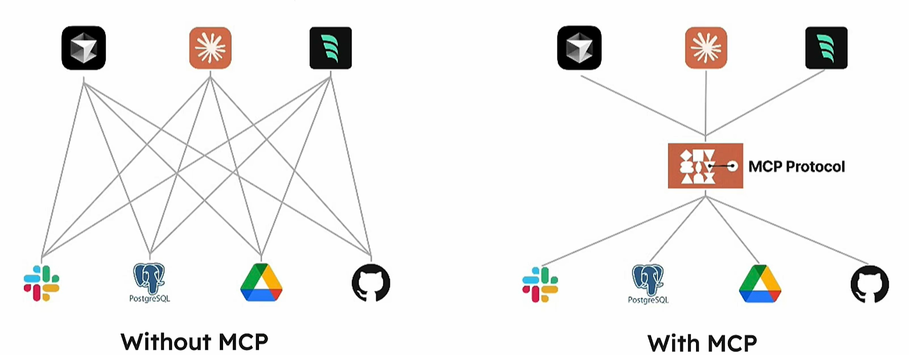
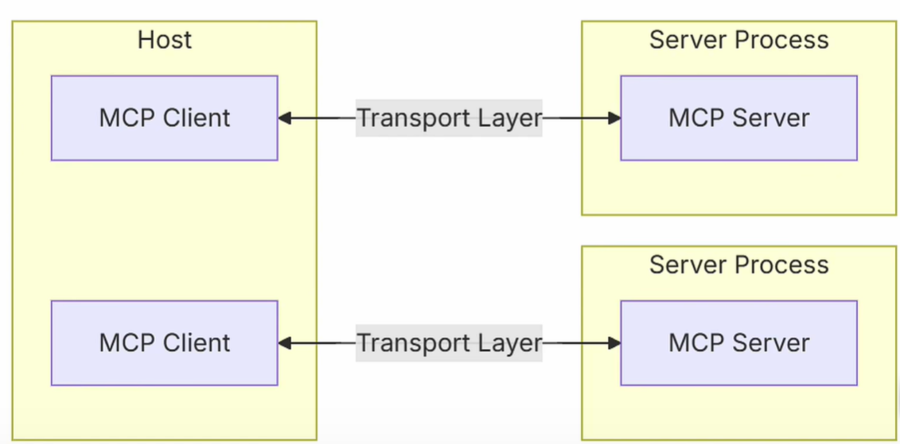
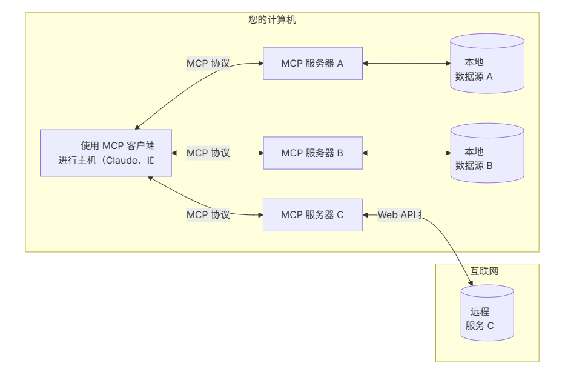
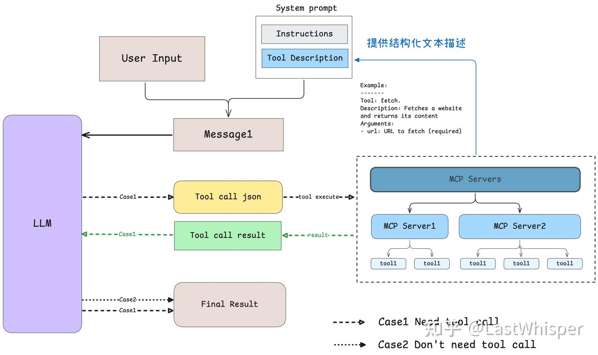

# MCP

## 1、现有的问题

MCP（模型上下文协议）是用于应用程序和AI模型之间交换上下文信息的方式。

这使得开发者能够以 一致的方式将各种数据源、工具和功能练剑到AI模型。


最早是通过人工筛选或者获取信息，再手动复制粘贴信息给大模型。

现有的程序设计是通过 function call来实现的。

> 什么是function call?

```python 
# 调用千问模型
def call_qwen_with_function(prompt):
    response = Generation.call(
        model="qwen-max",
        prompt=prompt,
        api_key=DASHSCOPE_API_KEY,
        tools=tools,
        stream=False
    )
    
    if response.status_code == 200:
        result = response.output
        if result.tool_calls:
            # 提取函数调用信息
            tool_call = result.tool_calls[0]
            function_name = tool_call["function"]["name"]
            arguments = json.loads(tool_call["function"]["arguments"])
            
            # 执行函数
            if function_name == "get_weather":
                city = arguments["city"]
                weather_result = get_weather(city)
                return weather_result
        else:
            return result.text
    else:
        return f"错误: {response.message}"
```

```python
# 调用ChatGPT模型
def call_chatgpt_with_function(prompt):
    response = openai.ChatCompletion.create(
        model="gpt-4",
        messages=[
            {"role": "user", "content": prompt}
        ],
        tools=tools,
        tool_choice="auto"
    )
    
    # 检查是否有函数调用
    if response.choices[0].message.get("tool_calls"):
        tool_call = response.choices[0].message["tool_calls"][0]
        function_name = tool_call["function"]["name"]
        arguments = json.loads(tool_call["function"]["arguments"])
        
        # 执行函数
        if function_name == "get_weather":
            city = arguments["city"]
            weather_result = get_weather(city)
            return weather_result
    else:
        return response.choices[0].message["content"]

```

可以看见的是，两个模型的调用方式其实是不一样的，chatgpt使用的是openai.ChatCompletion.create而千问使用的是Generation.call

如果更换模型，那么代码也需要相应的改变。


MCP的作用就是将不同服务进行统一的调用。模型和其它设备集成的标准接口，工具函数约定了输入输出的协议规范，实现更简单的通用的function call。



## 2、怎么调用

先给出结论：MCP是 prompt engineering （提示工程）的产物，其实它实际上是通过提示词来规范的。

## 3、MAC架构和demo



这是一个简单的MCP架构图，MCP采用CS架构，

其中HOST表示的是大模型的应用，用于负责接收问题。Client 用于和Server连接，Server就是上下文工具和prompt 给 client。应用开发者主要是提供对应的MCP server




1、HOST接受用户的命令

2、HOST中的client 与需要启动的Server 交互

3、Server会去获取对应的数据发还给Client


为了让大模型和应用结合，需要提供非常标准化的上下文管理

MCP统一了三个标准

1、工具的标准。具体应该是API调用规范，数据查询规范等

2、资源。数据流结构化构造。具体应该是 files，logs API responses

3、提示词。规范结构化的提示词。


具体过程

1、客户端获得问题，和将可能用到的工具发送给大模型

2、大模型分析选择工具

3、客户端执行MCP server

4、结果返回给大模型

5、大模型返回结果

6、展示



部分代码：

```python
all_tools = []
            for server in self.servers:
                tools = await server.list_tools()
                all_tools.extend(tools)

            tools_description = "\n".join([tool.format_for_llm() for tool in all_tools])

            system_message = (
                "You are a helpful assistant with access to these tools:\n\n"
                f"{tools_description}\n"
                "Choose the appropriate tool based on the user's question. "
                "If no tool is needed, reply directly.\n\n"
                "IMPORTANT: When you need to use a tool, you must ONLY respond with "
                "the exact JSON object format below, nothing else:\n"
                "{\n"
                '    "tool": "tool-name",\n'
                '    "arguments": {\n'
                '        "argument-name": "value"\n'
                "    }\n"
                "}\n\n"
                "After receiving a tool's response:\n"
                "1. Transform the raw data into a natural, conversational response\n"
                "2. Keep responses concise but informative\n"
                "3. Focus on the most relevant information\n"
                "4. Use appropriate context from the user's question\n"
                "5. Avoid simply repeating the raw data\n\n"
                "Please use only the tools that are explicitly defined above."
            )

            messages = [{"role": "system", "content": system_message}]

```


