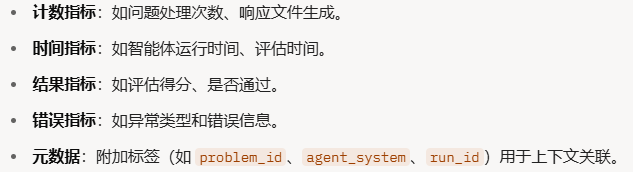
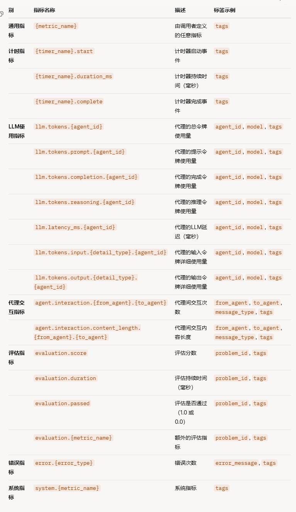
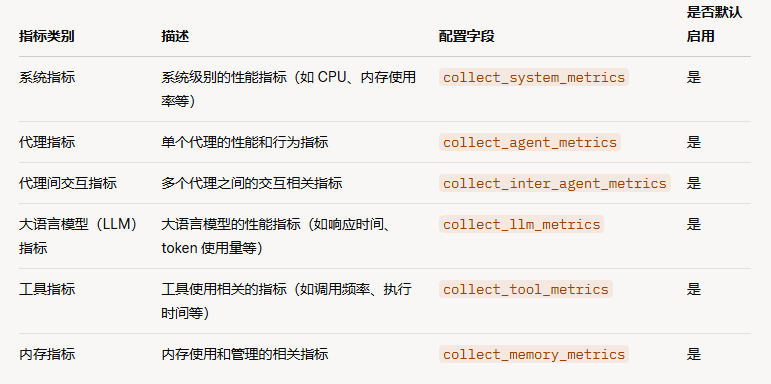

MCP Server 源码表示，只要专注于处理两个函数的数据即可，专注于处理 listTools 和 callTool 请求

这之中是不用考虑大模型的事的。

指标1、效率？这与功能有关系，

指标2、准确率

## MASArena

单智能体

多智能体

本项目 实现的基准测试 还是同 深度学习 的 benchmark 一致，新添加的 应该仅仅是 对智能体agent或者MCP Server的运行时间，出错率和资源使用情况（token、CPU、内存）的指标。

其所谓的评分也是基于 深度学习 benchmark 的评分，并非综合评分

考虑单一MCP Server 

- 错误率
- token 消耗
- 提供的 工具数量 和 token
- 耗费的时间

分类方式1（按照工具是否调用本地工具）

- 本地调用工具的代理
  内存使用率  CPU 使用率

- 调用线上攻击的代理 
  token消耗率 

分类方式2（按照工具的使用方式）

- **纯大模型思考**的MCP Server
- 需要使用本地工具的MCP Server
- 远程调用api 的MCP Server

分类方式3 （根据Server 的具体功能类别）

- 系统调用场景
- 交易场景
- 规划分析场景
- 搜索场景
- 代码场景
- 数据库场景
- 让各个场景的Server 做一件或几件属于自己场景的事

多MCP Server协作

- 各部分出错率和总出错率
- 总token调用
- 耗费时间
- 工具链长度
- 

