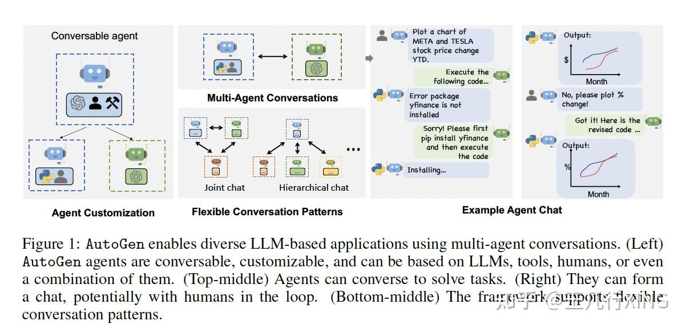
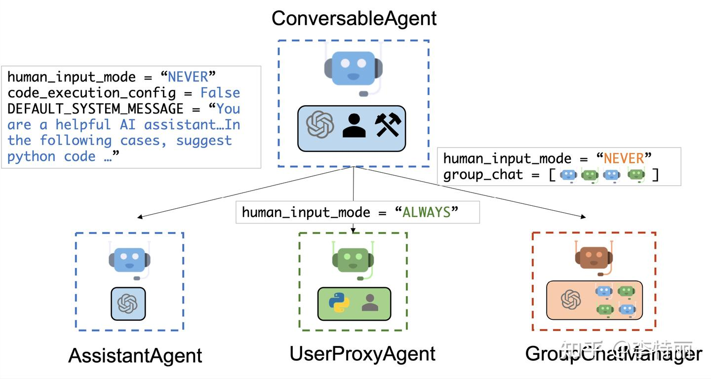

# 7.10

1. 学习 github 提交 branch 的方法
2. 实现 多智能体系统demo
3. 自测系统
4. 学会可视化并做出检测
5. 完成西湖大学issue，将autogen并入多智能体框架 

## 下周目标

1. 根据反馈修正issue


## 流程记录

按照西湖大学说法，他们解耦做得很好，也就是说我可以只关注多智能体的部分。

西湖大学提供了一个单一智能体的方法 其分成了两个部分

- 添加MAS 代码
- 扩展Evaluator 代码


#### 实现demo

1. 分析源码MAC 的base.py

我们可以base agent 是一个父类,所有的agents系统是继承于这个父类的。这个父类实现了两个类和一个方法。

##### Agent System 类

> Python中以"_“开头为私有方法，该方法无法在类外被调用

| 方法名                        | 方法作用                                                     |
| ----------------------------- | ------------------------------------------------------------ |
| format_prompt                 | 对不同的benchmarks 选择合适的提示词(如果添加了benchmark，包括数据，则在此方法指向的 format_prompts 类中添加对应的提示词，理论上此提示词会由源benchmark给出) |
| _initialize_evaluator         | 初始化 适当的 评估方法 基于 配置。理论上上游类会初始化self.evaluator 这个参数，在这里会引入评估方法，这边就会 引入数据。，该方法在 异步方法evaluate 被调用。 |
| _initialize_metrics_collector |                                                              |
| run_agent                     | 该方法是抽象类方法，这意味着该方法是在子类中一定要实现的方法 |
| _record_token_usage           | 记录 usage_metadata中记录的AI 信息 令牌使用指标，该方法在evalue 中被调用 |
| _record_agent_responses       | 保存智能体的响应到文件中，该方法在evalue 中被调用            |
| save_agent_responses          | 保存智能体的响应到文件中                                     |
| generate_visualization_data   | 生成用于代理交互可视化的数据。                               |
| evaluate                      | 在给出的问题（benchmark） 评估智能体系统                     |
| with_timing                   | 创建一个用于定时函数执行的装饰器                             |
| set_metrics_registry          | 设置一个智能体系统的 指标注册表                              |
| record_metric                 | 记录一个指标 如果这个指标是可以的话                          |
| generate_run_id               | 生成一个独一无二运行的ID                                     |
| get_agent_info                | 获得 智能体系统的信息                                        |

##### AgentSystemRegistry 类

> 类方法可以在不创建类的时候调用，可以直接通过类名.方法名进行调用

| 方法名                     | 方法作用                                                 |
| -------------------------- | -------------------------------------------------------- |
| _import_agent_systems      | 这是一个**类方法**，初始化智能体系统                     |
| register                   | 这是一个**类方法**，注册一个智能体系统名到注册表中。     |
| get                        | 这是一个**类方法，**获取config中说明的实例               |
| list_available             | 这是一个**类方法，**列出所有的可以用的智能体系统和其描述 |
| get_available_system_names | 这是一个**类方法，**得到所有智能体系统的名字             |
| get_all_systems            | 这是一个**类方法，**得到完整的智能体系统                 |

##### create_agent_system方法

该方法通过智能体的名字创建一个智能体系统 如果有use_tools 或者 use_mcp_tools 在config 中，那么 智能体系统将会被允许使用工具。


2、学习demo 样例

实现demo 样例代码如下： 

```python
from mas_arena.agents.base import AgentSystem, AgentSystemRegistry
# 所有的 MAS 都是继承于 AgentSystem 这个类
class SimpleMAS(AgentSystem):
    def __init__(self, name: str = "simple_mas", config: Dict[str, Any] = None):
        super().__init__(name, config if config else {})
        self.workers = None
	# 这是一个内部方法 其输入问题描述，并且它接受一个问题输入这个输入可以是任何类别，并且默认值是None，函数返回一个字典，值是AgentNode 这个字典
    def _create_agents(self, problem_input: Optional[Any] = None) -> Dict[str, AgentNode]: # 创建agent
        # 从
        agent = AgentNode(
            name="solver",
            model_name=self.config.get("model_name", "gpt-4"),
            prompt=f"Solve the problem: {self.format_prompt}"
        )
        return {"solver": agent}
	# 实现抽象方法 run_agent
    def run_agent(self, problem: Dict[str, Any], **kwargs) -> Dict[str, Any]:
        workers = self._create_agents(problem["problem"])
        response = workers["solver"](problem["problem"])
        return {
            "messages": [response],
            "final_answer": response.content
        }

# AgentSystemRegistry 在此处仅仅提供注册的作用 输入为 类字符串名 + 类名 + 配置
AgentSystemRegistry.register("simple_mas", SimpleMAS)
```

3、 如何 运行demo进行 测试？ 测试的目的是什么，我需要将其包装成什么样？输入输出是什么？

我们可以看到，demo 是集成了agentSystem 这个类，实现了一个内部方法，用于创建agent，并实现了抽象方法 run_agent，这个智能体为下文文的抽象方法提供了prompt，所使用的LLM模型等信息。


4、autogen 

-  autogen 是什么

是一个开源框架，autogen代理是可定制的，可对话的，通用框架，涵盖了多个领域。

其目的是促进发散思维，提高事实性和推理能力并提供验证

LLM可以解决复杂问题，多代理对话可以以直观的方式实现这种分解。

如何设计能够在多代理合作中表现出能力、可重用、可定制的有效个体代理？

实际上，不同复杂性的应用可能需要不同代理集合，并且可能需要不同的对话模式，如单回合或多回合对话，不同的人类参与模式，以及静态与动态对话。

---

- autogen框架



---

- autogen代理



我们可以看到其内置了三个代理

- AssistantAgent :助手代理。设计充当AI助手，默认使用LLM，但不需要人工输入或代码执行。它可以边写Python代码，供用户在收到消息（通常还需要解决的任务描述）时执行，在后台，Python代码是由LLM 编写的。它还可以接收执行结果并建议更正错误修复。可以
- UserProxyAgent :用户代理。是人类的代理，默认情况下，在某个交互回合中，将人工输入作为代理的回复，并且还有执行代码和调用函数的能力。当它在收到的消息中检测到可执行代码块且未提供人类用户输入时，会自动 UserProxyAgent 触发代码执行
- GroupChatManager :


用户代理代表用户工作 (我们人类），可以独立做决定或向真正的用户请求输入。

**助手代理是一个通用的AI助手，负责执行具体的任务。**

**AutoGen 实现了通过代理间对话解决任务的可对话代理。**


**autogen 是基于以下概念的通用多代理对话框架**

- 可定制的可对话的代理。
- 对话编程。
- 多代理应用集合。

- autogen 架构

**ConversableAgent类**是最高级别的代理抽象，默认情况下可以使用**LLMs、人类和工具**。

**AssistantAgent**和**UserProxyAgent**是两个预配置的ConversableAgent子类，分别代表常见的使用模式，即作为LLM支持的AI助手和作为人类代理以征求人类输入或执行代码/函数调用。

autogen 两个概念的范式

计算 和 控制流

控制流是由对话驱动的，参与代理决定发送消息给哪个代理以及计算的过程是代理间对话的函数。

---


- autogen 代码修改

**要求：**

AutoGen 是一个 灵活的模块化多代理框架，支持各种对话工作流和任务自动化，添加此系统将允许我们将其性能和功能与框架中的其他代理系统进行比较


**AutoGen的主要特点** 

- 模块化设计，可实现可定制的代理工作流
- 支持对话代理 和基于任务的自动化
- 与LLM集成，以增强推理和决策

**实施注意事项：**

- 确保与现有框架架构兼容
- 处理AutoGen要求的任何依赖项或先决条件
- 全面测试集成以验证功能和性能

##### 

我需要知道整个智能体系统的特点和流程，然后根据这个特点和流程找到对应的代码，然后将这个代码写进框架中。

1. 初始化
2. 任务发布与分解
3. 对话与协作
4. 任务执行
5. 反馈与优化
6. 结果输出


1. 看用autogen实现的智能体
2. 然后偷一个合适的过来
3. 实现它