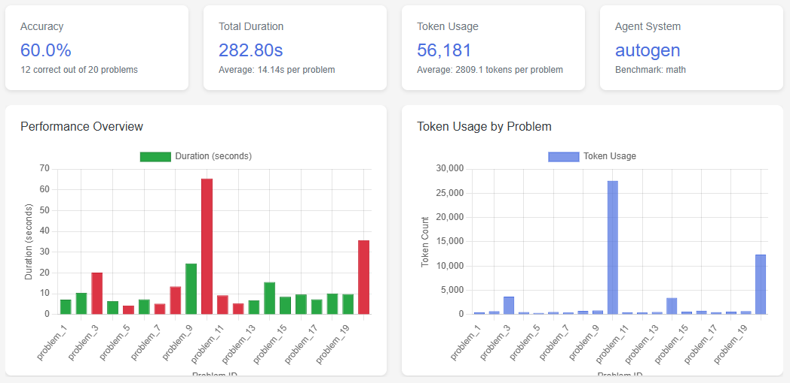
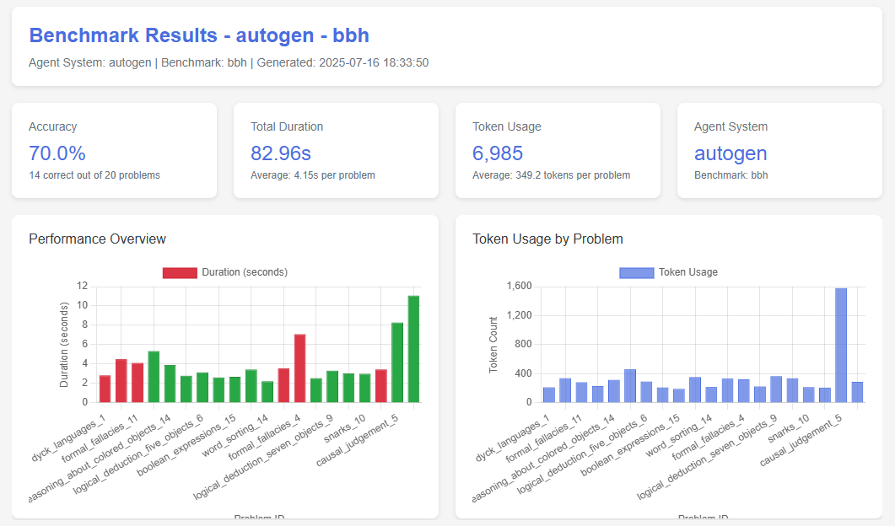
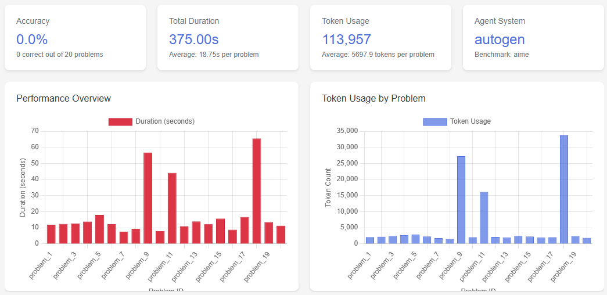

## 2025.7.17

### 完成工作

autogen的workflow的实现

在框架下的数据集进行了测试

### 实验结果

20个数据的结果

|        | math | AIME | DROP | MMLU_pro | BBH  | Humaneval |
| ------ | ---- | ---- | ---- | -------- | ---- | --------- |
| Origin |      |      |      |          |      |           |
| Arena  | 60%  | 0%   | 95%  | 50%      | 70%  | 80%       |

.PNG)

.PNG)

.PNG)

### 下周规划

1、修复 在 aime数据集上的成功率为0的 的bug

2、测原始autogen在数据集上的表现

3、查看 origin 和 本地实现出现差距的原因