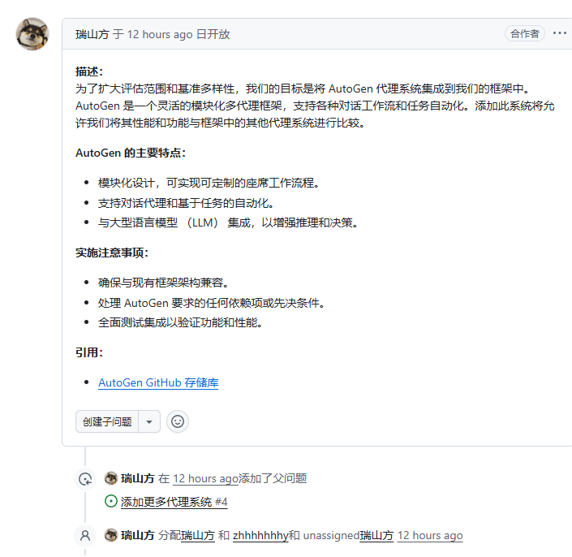
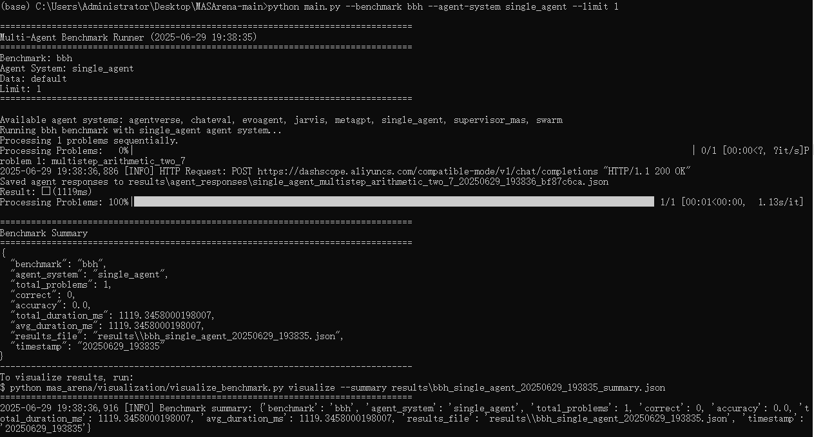

[LINs-lab/MASArena: A comprehensive framework for benchmarking single and multi-agent systems across a wide range of tasks—evaluating performance, accuracy, and efficiency with built-in visualization and tool integration.](https://github.com/LINs-lab/MASArena)

## 本周工作目标及总结

- 跑通框架流程（已完成）

  - > 简单跑通流程后，未发现其框架图有关工具调用的部分，并且其数据和agent 或MCP Server 关系不紧密

- 查看指标（已完成）

  - > 框架给出的指标包含， token消耗、时间和评分。其评分根据不同数据集有不同评分，具体由evaluate给出。

- 额外的：发现了一些有关智能体的benchmark文章

  - ReACT作者发布的 **Tau-Bench** [[2406.12045\] $τ$-bench：真实域中工具-代理-用户交互的基准 ](https://arxiv.org/abs/2406.12045)
    仅仅是添加了一个 pass^t 的指标，其意思是t次运行其成功率，并且其只使用了两个智能体，存在诸多不足。
  - 腾讯发布的 **Multi-Mission Tool Bench** [[2504.02623\] 多任务工具台：通过相关和动态任务评估基于 LLM 的代理的稳健性](https://arxiv.org/abs/2504.02623)
    提出了两个新指标，一个是最优路径率，一个是完成进度指标（区别原有的对错指标）。

  -  伯克利发布的 **BFCL-V3**  [gorilla/berkeley-function-call-leaderboard/README.md 在 main ·ShishirPatil/大猩猩](https://github.com/ShishirPatil/gorilla/blob/main/berkeley-function-call-leaderboard/README.md)。添加了状态评估（检查系统后端状态）和响应评估指标（交互输出的评估）
  - 腾讯[[2505.18746\] $C^3$-Bench：多任务处理中真正令人不安的基于 LLM 的代理](https://arxiv.org/abs/2505.18746) 这篇与MMTB指标相同，仅对数据集做了提升。

### 下周任务目标

解决此issue




## 流程记录

1、 安装uv 我使用的是 Windows的安装方法
powershell -ExecutionPolicy Bypass -c "irm https://github.com/astral-sh/uv/releases/download/0.7.12/uv-installer.ps1 | iex"

2、uv sync

3、安装一些杂七杂八的库

获得报错：OSError: [WinError 6] 句柄无效
	句柄是 Windows 操作系统用来标识资源（如文件、进程、线程等）的引用。出现此错误通常意味着程序尝试使用一个已经关闭、未正确初始化或不可用的资源。

更换了一个agent 就好了



```json
2025-06-29 19:38:36,916 [INFO] Benchmark summary: 
{
    'benchmark': 'bbh',
 	'agent_system': 'single_agent',
 	'total_problems': 1, 'correct': 0,
 	'accuracy': 0.0,
 	'total_duration_ms': 1119.3458000198007,
 	'avg_duration_ms': 1119.3458000198007,
 	'results_file': 'results\\bbh_single_agent_20250629_193835.json',  		'timestamp': '20250629_193835'
}
```


## Tau-Bench

T-Bench 使用的数据集的样子


## MMTB


