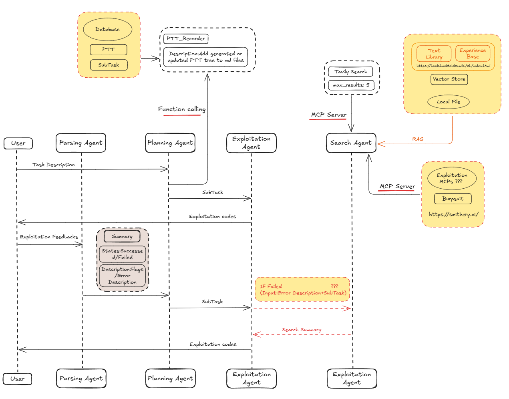

# Readme

## 模型

- 开发框架：[Google ADK](https://google.github.io/adk-docs/)
- workflow

  
- 这周进度

  - 还在调试底层数据库介入模型会不会卡bug
  - 还在优化 `Search Agent`,想要实现只基于 `Subtask`的直接搜索和总结

## 靶场

- 这周跑了7个靶场(Hack The Box)
