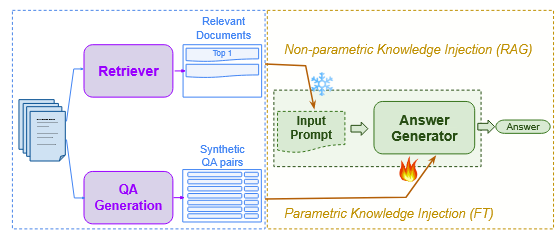
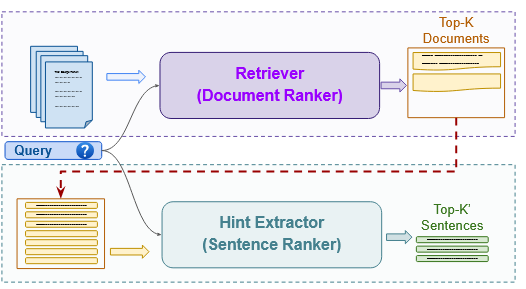

# 250918 README

## 数据集

https://www.exploit-db.com/  

CVE Types

* dos
* local
* remote
* webapps：46,435
  * 近三年：1357
* hardware

## Formatted output template

```
<CVE>
CVE-2024-4879
</CVE>

<keyword>
ServiceNow ,Input validation, Unauthenticated user
</keyword>

<description>
ServiceNow has addressed an input validation vulnerability that was identified in Vancouver and Washington DC Now Platform releases. This vulnerability could enable an unauthenticated user to remotely execute code within the context of the Now Platform. ServiceNow applied an update to hosted instances, and ServiceNow released the update to our partners and self-hosted customers. Listed below are the patches and hot fixes that address the vulnerability. If you have not done so already, we recommend applying security patches relevant to your instance as soon as possible.
</description>

<CWE>
CWE-1287: Improper Validation of Specified Type of Input
</CWE>

<exploit tree>
1.Input validation
1.1 Check target reachability with a GET to the base URL.
- If HTTP 200, target reachable
1.2 Send test template expression to /login.do?jvar_page_title=....
- If HTTP 200 and response contains 1337, vulnerability confirmed
1.3 If vulnerable, request information-extraction path /login.do?jvar_page_title=... that attempts to read conf/glide.db.properties.
- If HTTP 200, extraction response returned
1.4 Parse extraction response for database/config lines using patterns glide.db.*=, jdbc.*=, database.*=.
- If matches found, configuration data extracted and displayed
</exploit tree>

<code>
[CVE-2024-4879.py]
</code>
```

问题：复现流程和exploit流程有时候区分不太开

## Others

Fine Tuning vs. Retrieval Augmented Generation for Less Popular Knowledge, SIGIR 2024





