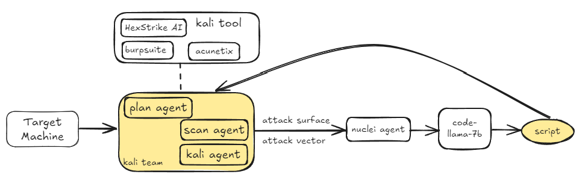

# 251107 README

目前接入了四个web扫描器和kali，遇到的问题：

- 不同的扫描器返回字段格式及命名方式不统一，需要分别预处理扫描器，保留必要的字段返回给agent，节省开销
- 针对不同靶机，扫描器检测到的漏洞数量不一（vulhub单漏洞场景可能顶多就5个可疑的攻击面），需要结合已确定要攻击的cve描述，筛选匹配攻击面，然后再生成nuclei模板
  - 目前找了一个多漏洞的公共靶机metasploitable2（80+个攻击面），用来验证设计的筛选匹配攻击面的模型的效果（依据：CWE、confidence、description）
  - 筛选完成以后，会得到多个扫描面，是一对一生成nuclei报告还是一对多生成nuclei报告
- 还没有解决需要登录验证的端口的自动化扫描问题。这类端口需要执行主动扫描，时间比较久，扫描效果也跟扫描器的能力有关
