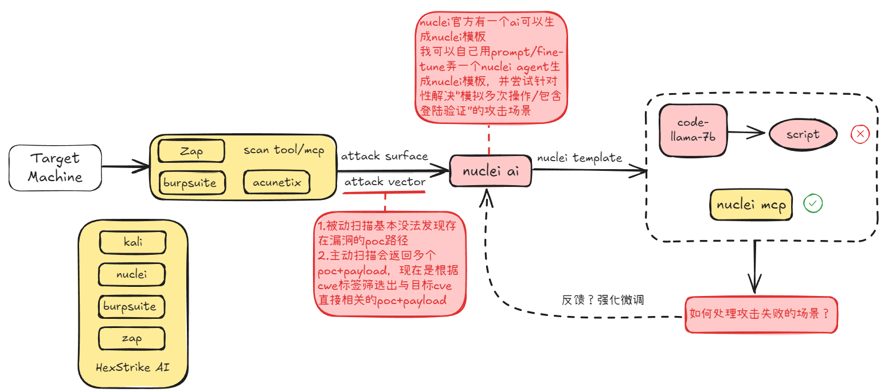

# 251114 README

扫描器分类

- banner scan:提取并分析服务的CPE string
- payload_based scan：使用payload来验证CVE，侵入式扫描
- passive scan——banner scan
- active scan——payload_based scan

active scan的不足

- 无法直接扫描网页中受保护的内容（如登录验证、验证码），需要配合其它功能模块解决
- 需要模拟多次操作的漏洞
- 无法伪造合法的 HTTP 请求

 
