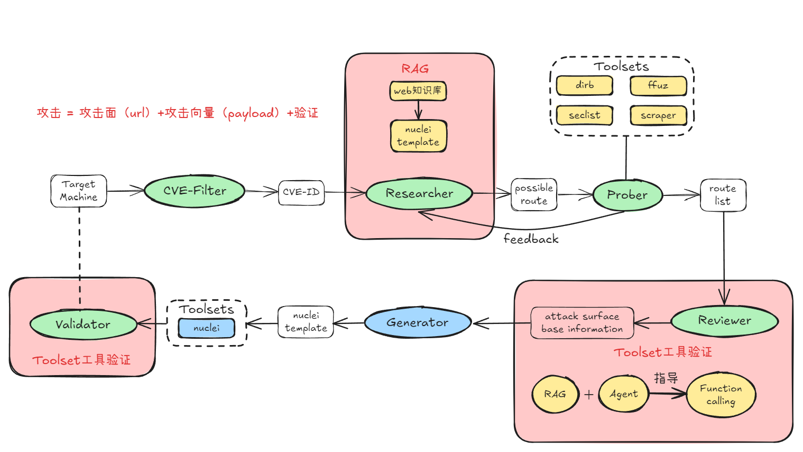

# 251219README

攻击 = 攻击面（url）+攻击向量（payload）+验证

## 攻击面

1. 单步场景单步请求链：`http://192.168.137.2:8080/index.php?a=id`
2. 复杂场景单步请求链：
   ```html
   POST / HTTP/1.1
   Host: your-ip
   Accept-Encoding: gzip, deflate
   Accept: */*
   Accept-Language: en
   User-Agent: Mozilla/5.0 (compatible; MSIE 9.0; Windows NT 6.1; Win64; x64; Trident/5.0)
   Connection: close
   Content-Type: application/x-www-form-urlencoded
   Content-Length: 125
   hostname=192.168.137.23&username=111&password=222
   ```
3. **复杂场景多步请求链：**

```yaml
# Output Schema (YAML)
cve_source_data:
  cve_id: "String (from tool)"
  cve_description: "String (Raw description from tool)"
  cve_category: "String (from tool)"
  cwe: "String (from tool)"

analysis_result:
  software: "String (Inferred software name)"
  strategy: "TARGETED" # or "FUZZING"
  reasoning: "String (Concise technical justification)"
  
  attack_vectors:
    - path: "String" # Specific URL for TARGETED, or "ANY" for FUZZING
      feature_keywords: # Required for FUZZING, generic list for TARGETED
        - "String"
      method: "GET" # or POST, PUT, ANY
      vulnerable_parameter: "String" # Specific param name or "FUZZ"
      payload_hint: "String" # Technical hint for the Generator
```

## 微调（攻击向量+验证）

4-->23 (总计230个)

遇到的问题：现在匹配器生成没有什么问题，有些payload模型可以生成，逻辑也对，但是不一定可用，需要做fuzzing

example: `../../../../../etc/passwd`

## 解决方案


